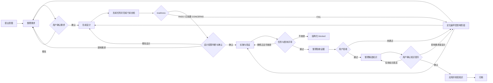

# AI 项目经理：第一版架构设计

状态：第一版架构基线（已确认）
阶段：实现
最近修订：2026-07-13
需求基线：[requirements.md](requirements.md)
相关调研：[agent-support-research.md](agent-support-research.md)
补强依据：[agentic-development-frameworks-research.md](agentic-development-frameworks-research.md)
第一阶段目标平台：Codex

## 1. 设计目标

第一版架构只解决一件事：让用户通过一个 AI 项目经理入口，把一次真实软件变化从模糊意图持续推进到已确认需求、可实施设计、实现验证、用户验收、知识提升和最终归档，并且在任何阶段中断后都能从项目文件恢复。

本设计遵守以下约束：

1. 受管理项目内的文件是项目和 Change 状态的唯一权威来源。
2. 聊天记录、Agent Memory、任务 UI、Hook 和子 Agent 只提供便利，不承担权威状态。
3. 业务判断由 AI 项目经理和用户完成；确定性工具只校验结构、摘要、状态门和文件变更。
4. 项目当前状态与 active Change 状态严格分离；archived Change 只用于历史追溯。
5. 核心流程可以被不同编码 Agent 使用；第一版只实现并验收 Codex 适配器。
6. 第一版不兼容上一版 `project-manager`，也不继承上一版工件和状态模型。

## 2. 总体架构

```text
用户
  |
  v
AI 项目经理入口
  |
  +-- 读取和判断 ------------------------------+
  |                                           |
  v                                           v
可移植流程 Skill                         Agent 适配器
  |                                      （第一版：Codex）
  |
  +-- 读写受管理项目材料
  +-- 调用确定性 CLI
  v
受管理项目
  +-- 项目当前状态：knowledge-base/ + engineering/ + 项目级约束
  +-- 进行中状态：changes/active/<change-id>/
  +-- 历史证据：changes/archived/<change-id>/

确定性 CLI
  +-- 初始化与创建 Change
  +-- 校验材料与状态门
  +-- 绑定确认与材料摘要
  +-- 生成恢复摘要
  +-- 应用知识提升并归档
```

核心原则是“判断与执行分离”：

- AI 项目经理理解业务意图、调研、发现矛盾、提出建议、判断影响范围并组织用户确认。
- 用户确认需求基线、重大设计、最终交付结果和知识提升。
- CLI 不判断某个设计是否合理，只验证该确认是否存在、是否仍绑定当前版本、是否满足进入下一阶段或归档的机械条件。

## 3. 受管理项目的目录与材料契约

### 3.1 第一版固定目录

```text
<project-root>/
├─ AGENTS.md
├─ PROJECT.yaml
├─ knowledge-base/
│  ├─ README.md
│  ├─ facts/
│  │  └─ <topic>/
│  │     ├─ README.md
│  │     └─ <knowledge-unit>.md
│  ├─ rules/
│  │  └─ <topic>/
│  │     ├─ README.md
│  │     └─ <knowledge-unit>.md
│  └─ decisions/
│     └─ <topic>/
│        └─ <decision-id>.md
├─ engineering/
│  └─ ... 当前工程实现和可执行验证
└─ changes/
   ├─ active/
   │  └─ <change-id>/
   │     ├─ change.yaml
   │     ├─ requirements.md
   │     ├─ design/
   │     │  ├─ README.md
   │     │  └─ <design-artifact>.md   按涉及范围选建
   │     ├─ delivery/
   │     │  ├─ README.md
   │     │  └─ <delivery-artifact>.md 按交付复杂度选建
   │     ├─ knowledge-update.md
   │     └─ knowledge.patch        可选；有知识变更时生成
   └─ archived/
      └─ <change-id>/
         └─ ... active Change 的完整终态快照
```

第一版固定这些路径，不提供路径重映射。固定约定减少发现逻辑、配置分支和跨 Agent 差异。将来只有真实项目证明固定路径不可行时才增加配置。

### 3.2 根材料的职责

#### `AGENTS.md`

保存所有 Agent 每次进入项目都必须看到的简短路由和稳定约束：

- 这是一个受 AI 项目经理管理的项目。
- 项目当前状态、active Change 和历史 Change 分别从哪里读取。
- 不得把聊天、Memory 或 archived Change 当作当前状态。
- 应调用哪个通用 Skill 和 CLI。

它不是知识库、Change 日志或状态数据库。

#### `PROJECT.yaml`

保存机器可读且很少变化的项目身份和契约版本：

```yaml
schema_version: 1
project_id: example-project
```

第一版不在这里保存当前阶段、当前 Change、知识摘要或 Agent 专用配置，避免形成第二份易漂移状态。文件名不包含 `manager`，因为它描述项目身份和材料契约，而不是某个执行角色或 Agent 实现。

### 3.3 项目当前状态

项目当前状态不是某一份汇总文件，而是下面三类权威来源的组合视图：

| 来源 | 负责回答 | 不负责回答 |
| --- | --- | --- |
| `knowledge-base/` | 已确认的产品事实、规则、长期架构和关键决策 | 未确认方案、实现进度、历史讨论 |
| `engineering/` | 当前代码、配置、测试和可执行行为 | 为什么形成某项长期约束 |
| `AGENTS.md` 与 `PROJECT.yaml` | 稳定工作规则、材料路由和契约版本 | 业务知识和 Change 阶段 |

知识库先按知识语义分类，再在每类下按稳定 topic 组织：

- 根 `README.md`：知识分类、topic 索引和阅读路由，不重复正文。
- `facts/<topic>/`：项目当前已经成立的产品事实、外部可观察行为、工程事实和长期系统边界。
- `rules/<topic>/`：持续有效的业务、工程、治理、安全和权限约束。
- `decisions/<topic>/`：需要保留原因、替代方案、取舍和后果的长期决策。
- facts 和 rules 中每个非空 topic 的 `README.md`：说明 topic 边界并索引知识单元，不承载大段重复正文。

topic 根据项目真实知识逐步形成，不预设一套适用于所有项目的主题清单。一个 `<knowledge-unit>.md` 围绕一个能够独立阅读、确认和演进的稳定问题；既不把整个 topic 堆进一个大文件，也不机械拆成“一条事实一个文件”。是否增加独立 `topics/` 阅读层留待真实使用验证；若以后增加，它只能导航 facts、rules 和 decisions，不能定义第二份项目真相。

依赖版本、普通目录结构和局部实现默认只存在于 `engineering/`，不重复进入知识库。

### 3.4 active Change 的材料职责

#### `change.yaml`

Change 唯一的机器可读状态文件，保存身份、当前阶段、基线、门状态、阻塞和恢复入口。它不承载需求或设计正文。

#### `requirements.md`

保存原始意图、调研结果、为什么做、目标、范围、非范围、约束和验收标准。需求确认绑定这份文件的确定性摘要。

#### `design/`

设计是一个材料集合，不是一份固定的 `design.md`。`design/README.md` 必须存在，负责：

- 给出当前设计结论和关键取舍的可评审摘要。
- 逐类说明本 Change 涉及或不涉及哪些设计范围及理由。
- 列出属于当前设计基线的全部设计材料。
- 标明重大决定和局部实现决定的权限分类。

简单 Change 可以把完整设计直接写在 `design/README.md`；复杂 Change 按真实设计对象增加文件，文件名描述对象而不是机械采用类别名。设计材料类型和触发条件如下：

| 类型 | 涉及时必须覆盖 |
| --- | --- |
| 架构与模块职责 | 系统边界、模块协作或长期技术约束发生变化 |
| 接口与协议 | API、事件、合约、命令或外部集成发生变化 |
| 数据 | 数据模型、存储、迁移、生命周期或数据责任发生变化 |
| 交互 | 用户流程、界面状态或其他外部可观察交互发生变化 |
| 安全 | 身份、权限、隐私、资金、密钥或信任边界发生变化 |
| 运行 | 部署、配置、可观测性、容量或故障恢复发生变化 |
| 决策记录 | 存在需要单独保留替代方案、取舍和后果的重要决定 |

类别是条件性要求，不要求创建空模板。允许增加领域专用类型，但必须在 `design/README.md` 说明职责。设计确认绑定 README 所列出的整个材料集合；集合中任一文件新增、删除或改变都会使旧确认失效。

#### `delivery/`

交付也是一个材料集合。`delivery/README.md` 必须存在，负责汇总当前实施状态、交付材料、未解决问题和验收准备度。简单 Change 可以把全部交付内容直接写在 README；复杂 Change 按实际需要增加材料：

| 类型 | 典型内容 |
| --- | --- |
| 实施任务 | 任务范围、状态、依赖和下一步 |
| 实现偏差 | 与确认设计的差异、影响判断和处理依据 |
| 验证证据 | 测试、检查、运行结果及其对应的验收标准 |
| 验收材料 | 面向用户的完成说明、限制和最终验收步骤 |
| 问题记录 | 尚存缺陷、阻塞、风险及责任方 |

文件名描述实际交付对象，例如 `tasks.md`、`verification.md` 或 `acceptance.md`，但类别不对应强制空文件。`delivery/README.md` 必须说明各类内容写在 README 本身还是独立材料中，并列出整个交付材料集合。验收确认绑定该集合，而不是一份固定的 `delivery.md`。

任务无论写在 `delivery/README.md` 还是独立 `delivery/tasks.md`，都必须构成可独立实施、验证和评审的小型交付契约，至少包含：

- 任务目标及对应的 `REQ-*`、`DES-*`、`AC-*`。
- `Consumes`：依赖的材料、接口、文件范围或前置任务。
- `Produces`：产生的代码、接口、数据或后续任务可消费结果。
- 预计修改范围。
- 验证方法、命令和预期结果。
- 当前状态及完成证据引用。

任务粒度以“能否独立拒绝、实施、验证和评审”为准，不按文件数量或固定时间机械拆分。

验证无论写在 `delivery/README.md` 还是独立 `delivery/verification.md`，都必须覆盖以下四个维度；确实不适用的维度需要说明理由：

1. **Completeness**：需求、任务和验收标准是否全部覆盖。
2. **Correctness**：实际行为是否满足需求和场景。
3. **Coherence**：实现是否遵守设计决定和项目长期约束。
4. **Engineering quality**：测试、静态检查、安全检查和运行证据是否满足项目要求。

每项 `EVID-*` 至少记录验证命令或操作、工作目录或环境、执行时间、退出码或结果、关键输出和所证明的断言。任何完成声明都必须引用当前 Change 中新近执行的验证证据；历史结果、推测或其他 Agent 的口头结论不能替代证据。

#### `knowledge-update.md`

保存本次准备提升、排除或修改的候选知识。每一项必须标明：

- 类型：事实、规则或决策；长期架构现状属于事实，形成原因和取舍属于决策。
- 目标知识文件。
- 建议新增、修改或删除的内容。
- 依据的需求、设计和验证证据。
- 用户处理结果：确认、排除或要求修改。

即使最终没有需要提升的知识，也必须在该文件明确记录“无知识变更”并由用户确认，避免把“尚未整理”误判为“没有变化”。

有知识变更时，AI 项目经理同时生成 `knowledge.patch`，作为将已确认候选内容应用到 `knowledge-base/` 的精确机器载荷。`knowledge-update.md` 负责让用户理解和选择，`knowledge.patch` 负责确定性预览和应用；知识确认同时绑定二者的摘要。如果目标知识在确认后发生变化导致补丁不能原样应用，必须重新生成预览并重新确认。没有知识变更时不创建该补丁。

### 3.5 跨材料追溯约定

第一版使用短、稳定的本地标识建立追溯，不引入独立需求数据库：

- `requirements.md`：需求 `REQ-*`，验收标准 `AC-*`。
- `design/` 材料：设计决定 `DES-*`，明确引用所满足的 `REQ-*` 和约束的 `AC-*`。
- `delivery/` 材料：任务 `TASK-*` 和证据 `EVID-*`，引用对应的需求、设计与验收标准。
- `knowledge-update.md`：候选知识 `KNOW-*`，引用形成它的需求、设计、验收或证据。

标识只要求在单个 Change 内唯一。`pm validate` 检查引用存在和基本覆盖关系，AI 项目经理负责判断内容是否真正满足，工具不以“存在链接”替代业务验收。

### 3.6 archived Change 的契约

归档时将完整 Change 目录从 `changes/active/` 移到 `changes/archived/`，不重新整理成另一种格式。归档后的 `change.yaml` 增加终态信息：

- `phase: archived`
- 归档时间。
- 最终实现版本或 Git 提交。
- 已应用知识文件及摘要。
- 验收和知识确认记录。

归档目录默认只读。修正文档错误需要新建 Change，不能直接改写历史证据。新 Change 的上下文发现和恢复流程都不得默认读取 `changes/archived/`。

## 4. 信息模型

### 4.1 项目模型

```yaml
schema_version: 1
project_id: example-project
```

“项目当前状态”由工具在读取时组合，不持久化派生副本：

```text
ProjectCurrentState =
  confirmed knowledge-base
  + current engineering tree
  + project-level instructions and contract version
```

这样可以避免更新代码或知识后忘记同步 `current-state.md`。

`project_revision` 用于定位 Change 启动时的整体工程版本，但不把整个知识库或整个 `engineering/` 的 digest 作为阶段门。总摘要过于粗糙：一个无关 topic 或无关模块变化也会制造阻塞。正式基线只登记当前 Change 实际读取和依赖的知识材料、工程范围及其 digest。

### 4.2 active Change 模型

`change.yaml` 的第一版结构如下：

```yaml
schema_version: 1
change_id: wallet-login-2026-07-12
title: 连接钱包登录
phase: requirements
status: active

base:
  project_revision: <git-commit-or-null>
  captured_at: <iso-8601>
  dependencies:
    knowledge:
      - path: knowledge-base/facts/wallet-authentication/login-session.md
        digest: <sha256>
        purpose: 当前钱包登录能力
    engineering:
      - path: engineering/web/
        digest: <sha256>
        purpose: 本次变化涉及的应用范围

materials:
  requirements:
    required:
      - requirements.md
    included: []
  design:
    required:
      - design/README.md
    included: []
  delivery:
    required:
      - delivery/README.md
    included: []
  knowledge:
    required:
      - knowledge-update.md
    included: []

gates:
  requirements:
    status: pending
    material_set: requirements
    confirmations: []
  design:
    status: pending
    material_set: design
    confirmations: []
  acceptance:
    status: pending
    material_set: delivery
    confirmations: []
  knowledge:
    status: pending
    material_set: knowledge
    confirmations: []

readiness:
  status: not_assessed
  assessed_artifacts: []
  concerns: []
  assessed_at: null

implementation:
  status: not_started
  baseline_revision: null
  final_revision: null
  checkpoint:
    scope_digest: null
    captured_at: null

knowledge_promotion:
  status: not_started
  candidate_digest: null
  patch_digest: null
  targets: []
  applied_files: []

blockers: []
review:
  iteration: 0
  max_iterations: <positive-integer>
  last_outcome: null

next_action:
  owner: ai_project_manager
  action: 整理原始意图并形成可确认需求
  inputs:
    - requirements.md

history:
  - at: <iso-8601>
    event: change_started
    summary: 从项目当前状态创建 Change
```

字段枚举保持有限且可校验：

- `phase`：`requirements`、`design`、`implementation`、`acceptance`、`knowledge`、`archive_ready`、`archived`。
- `status`：`active`、`blocked`、`completed`；只有归档终态使用 `completed`。
- 门 `status`：`pending`、`confirmed`、`invalidated`。
- `readiness.status`：`not_assessed`、`pass`、`concerns`、`fail`、`stale`。
- `implementation.status`：`not_started`、`in_progress`、`verified`。
- `knowledge_promotion.status`：`not_started`、`ready`、`applied`、`verified`。

`phase` 和各门状态都持久化，是为了让人和 Agent 直接看到当前进度；`pm validate` 必须验证它们之间没有矛盾，不能把互相冲突的字段留给 Agent 猜测。

`materials` 是确认对象的机器清单。`required` 是每个 Change 都必须存在的入口材料；`included` 是当前 Change 因实际范围增加的设计、交付证据或知识载荷。设计和交付材料清单必须分别与 `design/README.md`、`delivery/README.md` 一致。一个门确认时绑定该 material set 当时解析出的全部文件，而不是只绑定入口文件；被列入 `included` 后，该文件对当前确认门就是必需的。

### 4.3 阶段、可执行动作与实施就绪

`phase` 是用户可理解的宏观进度和治理边界，不是唯一执行逻辑。确定性 CLI 根据材料依赖、确认门、readiness 和 blocker 实时计算：

- `available_actions`：当前可以安全执行的动作。
- `blocked_actions`：当前不可执行的动作及精确原因。

这两个列表是 `pm status` 的派生输出，不写回 `change.yaml`，避免产生另一份需要同步的状态。持久化的 `next_action` 是 AI 项目经理从可执行动作中选择的推荐动作；`pm validate` 必须拒绝不属于 `available_actions` 的 `next_action`。

进入实施前必须完成 implementation readiness assessment，但不增加新的用户确认门。评估对象是当前需求、设计和实施任务材料，结果为：

- `pass`：可以请求设计确认或在设计门已确认后进入实施。
- `concerns`：每项 concern 都已有责任方和处理结论；涉及用户权限的 concern 必须随设计一起提交确认，否则不得进入实施。
- `fail`：存在语义阻塞，回到最早受影响材料。
- `stale`：被评估材料的集合或内容已经变化，必须重新评估。

`assessed_artifacts` 使用与确认记录相同的 `path + digest` 结构。每项 concern 至少记录标识、影响、责任方、处理结论以及是否触及用户确认权限；没有处理结论的 concern 不能被视为“已处置”。

readiness 至少检查需求与验收标准完整性、设计类型覆盖、需求与设计一致性、任务对需求和设计的覆盖，以及风险、权限分类和回退条件。复杂 Change 在 readiness 前形成 `delivery/tasks.md`；简单 Change 可以把同等任务信息写在 `delivery/README.md`。材料可以在其主要阶段到来前准备，但只有依赖满足时相应动作才可执行。

### 4.4 digest 的职责边界

digest 是对文件或明确文件集合计算的确定性内容指纹，第一版使用 SHA-256。它只回答“内容是否与记录时相同”，不证明内容正确，不是数字签名，也不替代 Git 历史。

第一版保留三种用途：

1. **确认绑定**：需求、设计、验收和知识确认记录绑定当时 material set 中每个文件的 digest。集合或内容变化后旧确认自动失效。
2. **依赖漂移提示**：`base.dependencies` 只登记当前 Change 实际依赖的知识文件和工程范围。digest 变化时进入重新评估；AI 项目经理判断无影响后可以更新依赖记录，存在影响时按最早受影响阶段回退。
3. **应用结果校验**：知识提升后记录目标知识文件 digest，证明归档时的当前知识与已确认补丁应用结果一致。

知识提升对每个目标知识单元使用三方前置条件：

- `candidate_digest` 与 `patch_digest`：用户确认的候选知识和精确补丁版本。
- `before_digest`：生成补丁时目标知识单元的内容指纹。
- `after_digest`：成功应用后目标知识单元应具有的内容指纹。

应用前任一当前目标与 `before_digest` 不同，工具必须拒绝整个提升操作并要求重新预览、重新确认；应用后任一目标与 `after_digest` 不同，工具必须判定失败且不得归档。多目标提升必须先检查全部前置条件，再作为一个不可部分成功的操作应用。

```yaml
knowledge_promotion:
  status: ready
  candidate_digest: <sha256>
  patch_digest: <sha256>
  targets:
    - path: knowledge-base/rules/wallet-authentication/signing-security.md
      before_digest: <sha256>
      after_digest: <sha256>
```

`implementation.checkpoint.scope_digest` 记录最近一次明确工作检查点的相关工程范围，用于新会话发现检查点之后的工作区变化。它只触发差异检查，不自动删除、覆盖或判定这些变化无效。

整个 `knowledge-base/` 或整个 `engineering/` 的总 digest 可以由 `pm status` 临时计算并作为辅助信息，但不持久化为确认门，也不能因为无关变化自动阻塞 Change。

### 4.5 确认记录

门确认不能只写 `true`。每次确认必须绑定确认对象的版本：

```yaml
status: confirmed
confirmations:
  - revision: 2
    artifacts:
      - path: requirements.md
        digest: <sha256>
    confirmed_by: user
    confirmed_at: <iso-8601>
    summary: 确认目标、范围、非范围和验收标准
    evidence: 用户在当前材料评审后明确确认
```

设计门的 `confirmed_by` 可以是：

- `user`：设计含必须由用户决定的事项。
- `ai_project_manager`：设计只含确认范围内的局部、可逆实现选择；必须同时记录权限分类和理由。

第一版在 `design/README.md` 的“权限分类”小节使用两个固定字段：`确认责任：user | ai_project_manager` 与非空的 `理由`。CLI 只验证字段存在、责任枚举以及 readiness concern 是否触及用户权限；设计是否真的属于重大决定仍由 AI 项目经理按权限策略评估，CLI 不根据措辞替代该判断。

需求、验收和知识门只能由用户确认。文件内容变化导致摘要不匹配时，工具将对应确认标记为失效，不能继续沿用旧确认。

### 4.6 状态、事实和事件的关系

- `change.yaml` 保存当前可执行状态和简短事件历史。
- Markdown 材料保存可评审正文和证据。
- Git 保存文件级演进历史，但不是工作流门状态的替代品。
- `history` 只追加阶段变化、确认、失效、readiness、blocker、评审回环、知识应用和归档等关键事件，不记录每次对话和每个命令。

## 5. 状态流转与确认门



### 5.1 阶段及完成条件

| 阶段 | AI 项目经理的主要工作 | 完成条件 | 下一阶段 |
| --- | --- | --- | --- |
| `requirements` | 读取项目当前状态，调研和整理需求 | 用户确认当前 `requirements.md` 摘要 | `design` |
| `design` | 形成方案、任务、取舍和权限分类，执行自检与 readiness | readiness 为 `pass` 或 concerns 已处置，整个设计材料集合已按权限策略确认 | `implementation` |
| `implementation` | 实施、测试、记录偏差和证据 | 交付材料集合完整，验证达到验收准备条件 | `acceptance` |
| `acceptance` | 对照需求和设计提交结果与证据 | 用户确认当前交付材料集合所表达的结果 | `knowledge` |
| `knowledge` | 整理候选知识并处理反馈 | 用户确认知识包，且工具已应用并校验 | `archive_ready` |
| `archive_ready` | 检查全部门和终态引用 | 归档检查通过 | `archived` |

`pending` 不等于阻塞。当下一步属于 AI 项目经理时继续执行；只有需要用户决定、缺少外部权限或存在无法自主化解的冲突时，才把 `status` 设为 `blocked`，并让 `next_action.owner` 指向用户或外部责任方。

### 5.2 blocker 与评审收敛

`blocked` 不能只是一项布尔状态。每个未解决 blocker 至少保存：

- `reason`：为什么当前不能继续。
- `blocked_by`：用户、AI 项目经理、外部责任方或外部系统。
- `resume_when`：可以恢复的可检查条件。
- `affected_stage`：最早受影响阶段。
- 创建时间和当前处理状态。

存在未解决 blocker 时 `status` 必须为 `blocked`；没有未解决 blocker 时不得保留该状态。`pm status` 仍可列出处理 blocker、修订材料或提供外部输入等可执行动作。

任务评审和整体评审采用同一收敛规则：

1. 每次评审结果和处理决定追加到 `history` 或相应交付材料，不能覆盖旧结果。
2. `review.iteration` 每进入一次“发现问题后修正再评审”的完整回环就增加。
3. 达到 `max_iterations` 仍未满足退出条件时，创建 `reason: non_converging` 的 blocker，停止自动修补并请求责任方判断。
4. blocker 解决后可以继续原阶段，也可以根据根因回到最早受影响阶段。

`implementation.baseline_revision` 在实际实施开始时记录，`final_revision` 在验证完成时记录；二者与交付证据共同界定本次 Change 的工程范围。

第一版将 `blocked_by` 固定为 `user`、`ai_project_manager`、`external` 或 `external_system`，将 `review.last_outcome` 固定为 `passed`、`changes_requested` 或 `null`。当 `last_outcome: changes_requested` 且 `iteration` 达到 `max_iterations` 时，必须存在一个未解决的 `non_converging` blocker；此时 resolver 只允许处理 blocker 或显式回退，不再给出继续自动修补或评审动作。每次 changes-requested 回环追加 `review_changes_requested` history event，不能用更新计数替代旧记录。

### 5.3 确认动作

用户不需要直接编辑 YAML 或运行命令。请求任何用户确认前，AI 项目经理必须先执行与该门对应的自检：

| 确认门 | 自检重点 |
| --- | --- |
| 需求 | 目标、范围、非范围、验收标准、冲突和遗漏 |
| 设计 | 需求覆盖、设计类型覆盖、readiness、风险、替代方案和权限分类 |
| 验收 | completeness、correctness、coherence、engineering quality 和剩余问题 |
| 知识 | 知识类型、目标位置、长期有效性、确认补丁及是否混入局部实现细节 |

自检结论写入对应入口材料，不增加用户确认门。自检未通过时继续由 AI 项目经理修订或按权限策略请求必要决定，不能把第一遍生成结果直接提交确认。

用户在 AI 项目经理入口表达确认后，AI 项目经理必须：

1. 复述确认覆盖的内容和仍不覆盖的内容。
2. 确保待确认文件已经包含该结论。
3. 调用确定性工具计算摘要并写入确认记录。
4. 更新当前阶段和下一动作。
5. 把持久化结果告知用户。

没有明确确认时不得根据沉默、继续讨论或代码已完成推断用户已经确认。

### 5.4 知识提升与归档

知识提升的顺序固定为：

1. AI 项目经理整理 `knowledge-update.md` 中的候选项和用户可理解的建议措辞。
2. 工具根据最终候选项生成 `knowledge.patch`，记录候选、补丁、目标 `before_digest` 和预期 `after_digest`，并展示精确变更预览。
3. 用户确认同时绑定 `knowledge-update.md` 和 `knowledge.patch`；无知识变更时只绑定前者。
4. 工具先校验全部目标的前置条件，再以不可部分成功的方式应用已确认补丁，并校验知识索引、目标文件和全部 `after_digest`。
5. 把应用结果写入 `change.yaml`。
6. 执行归档检查并移动完整 Change 目录。

`pm validate`、`pm knowledge apply` 和 `pm archive apply` 必须复用同一个 canonical state resolver 和门判断实现。任何前置条件、应用结果或归档门失败都必须返回非零退出码，不能由不同命令产生不同结论。

用户对交付结果和知识包的确认已经授权完成这次 Change，因此第一版不再增加一次内容重复的“是否归档”确认。不可逆外部发布、资金操作或生产部署仍按权限策略单独确认，它们不能被归档授权隐含覆盖。

## 6. 决策权限策略

### 6.1 必须由用户确认

以下事项只要发生，就必须停止在确认门前：

- 需求基线及任何改变目标、范围、非范围或验收标准的修改。
- 用户可见行为、业务规则或系统责任边界的改变。
- 重要架构选择或会形成长期技术约束的决定。
- 安全、隐私、身份、权限、资金、密钥、数据所有权和合规决定。
- 不可逆操作、生产发布、外部消息或会产生显著成本的操作。
- 需求与项目当前知识冲突时选择修改哪一方。
- 最终交付验收。
- 候选知识的确认、排除和提升。

### 6.2 AI 项目经理自主决定

在已确认需求和关键设计内，AI 项目经理自主完成：

- 项目读取、调研、矛盾分析、遗漏补充和方案推荐。
- 不改变外部行为或长期约束的模块拆分和局部实现设计。
- 可逆的代码调整、重构、测试、格式化和文档同步。
- 任务排序、验证方法选择、证据整理和非阻塞问题处理。
- 调用只读工具和确定性流程工具。
- 对实现缺陷进行修复并重新验证。

### 6.3 无法明确分类时

先判断该决定是否可能触及用户确认类别：

- 可能触及：整理影响、选项和推荐，交给用户确认。
- 明确不触及：AI 项目经理自主推进，并在相应设计或交付材料中记录理由。

项目可以在 `knowledge-base/rules/<topic>/` 中增加更严格的权限约束，但不能通过项目规则取消需求基线、重大风险、最终验收和知识提升的用户确认责任。

## 7. 流程回退策略

回退不是把整个 Change 清空，而是使最早受影响阶段及其下游确认失效。

| 新发现影响 | 保留 | 失效并重做 |
| --- | --- | --- |
| 需求目标、范围、约束或验收标准 | 原始意图、调研证据 | 需求确认、设计确认、实现有效性、验收、知识确认 |
| 已确认关键设计 | 需求确认 | 设计确认、受影响实现、验收、知识确认 |
| 仅局部实现 | 需求和设计确认 | 受影响任务与验证证据 |
| 验收发现实现缺陷 | 需求和设计确认 | 实现完成状态、验收确认 |
| 知识包文案或归属 | 需求、设计、实现和验收 | 知识确认与应用 |
| 知识反馈实际改变产品或设计 | 最早不受影响的上游材料 | 从需求或设计开始的全部下游状态 |

回退操作必须：

1. 记录触发原因和最早受影响阶段。
2. 将下游门标记为 `invalidated`，保留旧记录用于追溯。
3. 更新 `phase` 和 `next_action`。
4. 不删除已有代码和证据；先判断哪些仍可复用。
5. 重新确认后产生新的 `revision` 和摘要，不能覆盖旧确认记录。

`pm invalidate <stage> <id> --reason <reason>` 只执行调用者明确指定的影响层级，不自行判断“最早受影响阶段”。requirements 回退失效全部下游；design 回退保留需求确认；implementation 回退保留需求、设计和 readiness；acceptance/knowledge 回退分别保留已经验证或验收的上游事实。命令保留材料、代码、confirmation 数组和 history，只清理当前下游有效性指针；已经原子应用或验证的项目知识不能通过 invalidate 隐藏。

## 8. 中断恢复模型

新会话恢复 active Change 时，AI 项目经理按固定顺序执行：

1. 从仓库根读取 `AGENTS.md` 和 `PROJECT.yaml`。
2. 读取 `knowledge-base/README.md` 路由到与当前 Change 有关的项目知识，并核对已登记知识依赖的 digest。
3. 核对已登记工程范围、最近实施检查点和 Git 工作区，确认当前实现与记录是否一致。
4. 列出 `changes/active/`；如果有多个 Change，按用户指定或明确的最近上下文选择，不能猜测合并。
5. 读取目标 `change.yaml`，校验 schema、文件摘要、门、readiness、blocker 和评审状态。
6. 读取当前阶段材料、未解决 blocker 和 `next_action` 指向的输入。
7. 运行状态命令，输出“当前目标、已确认结论、当前阶段、available actions、blocked actions、推荐下一步、blocker、工作区偏差和恢复条件”。
8. 从下一步继续，不要求恢复完整聊天历史。

如果已登记依赖或实施检查点发生变化，恢复检查必须报告具体路径和差异。能证明不影响当前基线时更新依赖记录；可能影响需求、设计或实现时，按回退策略处理。未登记范围的变化作为辅助工作区信息报告，不因无关变化自动阻塞当前 Change。

第一版的知识依赖必须位于 `knowledge-base/`，工程依赖必须位于 `engineering/`。依赖可以登记文件或目录；目录摘要使用 Git tracked 加 untracked-but-not-ignored 文件清单，无 Git 时使用排除 VCS 元数据、依赖缓存和事务临时目录的安全遍历。checkpoint 的 `current_scope_digest` 由当前已登记工程依赖的 `path + current digest` 清单确定性计算。依赖或 checkpoint 漂移只派生 `reassess_dependency_drift` 和精确恢复条件，不替 AI 判断实际影响；Git 工作区中未登记范围的变化标为 information，不取消原本可执行动作。

## 9. 可移植核心与 Codex 适配器边界

### 9.1 可移植核心

可移植核心包含：

- 本文定义的目录、信息模型、状态门、权限和回退语义。
- 一份标准 Agent Skill 源码。
- Agent 无关的 schema 和确定性 CLI。
- 所有受管理项目中的权威材料。
- Agent 一致性验收场景。

核心只能假设 Agent 能读取文件、编辑文件和运行命令。核心正确性不能依赖插件、Hook、子 Agent、Agent Memory、特定 UI 或特定模型。

### 9.2 Codex 适配器

第一版 Codex 适配器负责：

- 安装并暴露 AI 项目经理 Skill。
- 为 Codex 提供稳定的用户入口和简短说明。
- 将通用 Skill 放到 Codex 可发现的位置。
- 映射 Codex 的权限、工具调用和任务交互方式。
- 提供 Codex 环境下的端到端测试。
- 可选使用子 Agent、并行工具和 Hook 提升效率。

Codex 适配器不得：

- 把 Codex 任务、Memory 或内部计划当作 Change 状态。
- 在 Codex 专用文件中复制需求、设计或知识正文。
- 让只有 Codex Hook 才能执行的检查成为归档的唯一保障。
- 让子 Agent 输出直接成为权威结论；输出必须由 AI 项目经理吸收到标准 Change 材料。

### 9.3 已确认的实现源码与发布布局

下面是 `my-workflow` 后续实现阶段的目标布局，不是受管理项目目录：

```text
src/
├─ core/
│  ├─ manifest.yaml
│  ├─ schemas/
│  │  ├─ project.schema.json
│  │  └─ change.schema.json
│  ├─ skills/
│  │  └─ ai-project-manager/
│  │     └─ SKILL.md
│  └─ runtime/
│     ├─ cli/
│     │  ├─ main.ts
│     │  ├─ create-cli.ts
│     │  ├─ options.ts
│     │  ├─ commands/
│     │  │  ├─ init/index.ts
│     │  │  ├─ change/start/index.ts
│     │  │  ├─ confirm/index.ts
│     │  │  ├─ invalidate/index.ts
│     │  │  ├─ status/index.ts
│     │  │  └─ validate/index.ts
│     │  ├─ output.ts
│     │  └─ errors.ts
│     ├─ governance/
│     │  ├─ blockers.ts
│     │  ├─ confirmations.ts
│     │  ├─ invalidation.ts
│     │  ├─ readiness.ts
│     │  ├─ recovery.ts
│     │  ├─ review.ts
│     │  └─ self-checks.ts
│     └─ operations/
│        ├─ confirm.ts
│        └─ invalidate.ts
└─ adapters/
   └─ codex/
      ├─ ... Plugin Manifest 与安装材料
      └─ ... Codex 端到端测试
```

Claude Code 等后续适配器只能增加适配层，不能复制或修改一套独立核心语义。

`src/core/manifest.yaml` 描述核心版本、Skill、schema、运行时入口和需要投影的公共资产。Codex Plugin manifest、命令入口和未来 Agent 适配材料由核心 manifest/schema 与各适配器模板生成，不手工复制流程正文。

第一版采用 Vite+ 统一开发工具链：`src/` 是唯一源码与静态资产输入，`dist/` 是唯一完整发布单元。`dist/` 必须包含可直接由 Node 24 运行的 CLI bundle、核心 manifest/schema/Skill 和 Codex 适配器资产，不得在运行时回到仓库根、`src/` 或 `node_modules` 取文件。第三方运行依赖按 CLI 入口依赖图内联，Node 内置模块保持 external；第一版不发布 `.d.ts`、稳定 JS library API 或免 Node 的 standalone executable。

CLI 边界使用 CAC 注册命令、解析 argv 和生成帮助。每个 `commands/<command>/index.ts` 只声明命令、收窄输入、调用既有 operation 并交给统一输出；CAC 类型和错误不得进入 project、materials、state 或 operations 模块，命令入口不得重新实现状态门或业务判断。

```text
dist/
├─ package.json
├─ bin/
│  └─ pm.js
├─ core/
│  ├─ manifest.yaml
│  ├─ schemas/
│  └─ skills/
└─ adapters/
   └─ codex/
      └─ ... 由核心资产与 Codex 模板生成的安装材料
```

Codex 适配器与核心共同发布在一个 `dist/` 中，但源码依赖方向不变：`src/adapters/codex/` 可以消费核心公共资产，`src/core/` 不得导入适配器。单一发布单元不把适配器变成第二套状态语义，也不把它定义为独立产品。

## 10. 第一版最小实现面

### 10.1 最少文档和状态材料

每个受管理项目最少需要：

- 根目录：`AGENTS.md`、`PROJECT.yaml`。
- 当前知识：`knowledge-base/README.md` 以及 `facts/`、`rules/`、`decisions/`；topic 和知识单元按已确认的真实知识创建。
- 工程实现：`engineering/` 及项目已有测试入口。
- 每个 active Change：`change.yaml`、`requirements.md`、`design/README.md`、`delivery/README.md`、`knowledge-update.md`；按实际范围增加设计和交付材料，存在知识变更时另有工具生成的 `knowledge.patch`。
- 历史目录：空的 `changes/archived/` 也必须可发现。

这五项必需 Change 材料分别承担机器状态、需求基线、设计入口、交付入口和知识提升。设计与交付基线分别是其 README 声明并由 `change.yaml.materials` 登记的整个材料集合。`knowledge.patch` 是可丢弃并重新生成的机器载荷，不是第六份权威说明文档；其他材料只在变化范围要求时创建。

### 10.2 最少 Skill

第一版只需要一个通用 `ai-project-manager` Skill。它包含：

- 项目和 Change 发现顺序。
- 各阶段职责与完成条件。
- available actions 解析和推荐下一动作的规则。
- 各确认门的 AI 自检与 implementation readiness 协议。
- 决策权限和回退判断。
- blocker、评审收敛和非收敛处理。
- 任务契约与四维验证协议。
- 材料写入规则。
- 知识提升三方前置条件。
- CLI 调用规则。
- 用户确认表达和恢复摘要格式。

需求分析、架构、安全、测试或知识审查先作为 Skill 内的逻辑职责，由主 Agent 顺序执行。第一版不要求独立角色 Skill 或子 Agent；真实使用证明需要独立上下文或专业门时再拆分。

Codex 适配器只增加一个安装入口，不复制第二份 Skill 正文。

### 10.3 最少确定性工具

第一版提供一个 Agent 无关 CLI，暂称 `pm`，包含以下子命令：

| 命令 | 确定性职责 |
| --- | --- |
| `pm init` | 初始化固定目录、项目配置和最小模板 |
| `pm change start <id>` | 从项目当前状态创建 active Change 并记录基线 |
| `pm status [id]` | 通过 canonical resolver 输出恢复摘要、available actions、blocked actions 和推荐下一动作 |
| `pm validate [id]` | 校验 schema、材料摘要、阶段、门、readiness、blocker、评审状态和下一动作一致性 |
| `pm confirm <gate> <id>` | 在已有明确确认且门前自检满足后，将材料摘要绑定到门记录 |
| `pm invalidate <stage> <id> --reason <reason>` | 保留历史并使调用者明确指定的受影响阶段及下游门失效 |
| `pm knowledge preview/apply <id>` | 生成或原子应用 `knowledge.patch`，并校验候选、补丁及目标 before/after digest |
| `pm archive check/apply <id>` | 使用同一 resolver 检查终态门并原样移动 Change 目录 |

`pm confirm` 不能自行决定用户是否同意；调用者必须提供确认人、摘要和证据说明。`pm knowledge apply` 和 `pm archive apply` 必须拒绝未满足的门，不能用 `--force` 绕过。

第一版不需要常驻服务、数据库、Web 控制台、通用工作流引擎、跨项目服务或 MCP Server。

## 11. “连接钱包登录”完整架构演练

以下是架构演练，不是对某个实际业务项目需求或技术方案的预先确认。它用于证明材料、确认门、恢复和归档可以形成闭环。

### 11.1 创建 Change

用户表达：“实现连接钱包登录。”

AI 项目经理读取项目当前知识和工程后执行：

```text
pm change start wallet-login-2026-07-12
```

结果：

- 创建五项必需 Change 材料以及 `design/`、`delivery/` 目录。
- `change.yaml.phase = requirements`。
- 记录当前 Git 版本，并随着需求整理登记实际读取的知识材料和工程范围。
- `pm status` 推导 `available_actions: [draft_requirements]`，实施等动作进入 `blocked_actions`。
- `next_action` 推荐整理需求，不把原始一句话直接标记为需求。

### 11.2 整理并确认需求

AI 项目经理通过调研和澄清发现“连接”和“登录”不是同一件事，并在示例 `requirements.md` 中形成：

- 目标：用户使用浏览器中的 EVM 钱包证明地址所有权并建立应用会话。
- 行为：连接钱包后发起一次无链上交易的签名认证；成功后显示当前地址和登录状态。
- 安全约束：服务端 nonce 一次性使用，会话有有效期，签名不得被解释为资产授权或交易。
- 范围：桌面浏览器、项目已支持的钱包、指定链环境。
- 非范围：创建或托管钱包、代付 Gas、移动端深链、社交账号绑定。
- 验收：成功、拒签、nonce 重放、切换账户、断开连接和会话过期均有可验证结果。

AI 项目经理先完成需求自检，确认目标、范围、非范围、验收标准、冲突和遗漏均已处理，再提交用户。用户修改范围后明确确认，AI 项目经理将最终内容写回文件并运行：

```text
pm confirm requirements wallet-login-2026-07-12
```

需求门记录 `revision: 1`、文件摘要和用户确认摘要，阶段进入 `design`。

### 11.3 设计与第一次中断恢复

示例设计选择 SIWE 风格的签名消息、服务端 nonce、HttpOnly 会话 Cookie，并列出钱包适配层、认证 API、会话模块和前端状态职责。该 Change 使用以下设计集合：

- `design/README.md`：设计摘要、类型覆盖和材料索引。
- `design/wallet-session.md`：钱包、认证 API、会话模块和前端状态的边界及接口。
- `design/session-security.md`：nonce、签名校验、Cookie、过期和账户切换的安全设计。

后两份文件登记到 `change.yaml.materials.design.included`；未涉及独立数据迁移和运行部署变更的理由记录在 `design/README.md`，不创建空文件。

AI 项目经理同时在 `delivery/tasks.md` 形成带追溯、Consumes、Produces、修改范围和验证条件的实施任务，完成设计门前自检和 readiness assessment。nonce 重放、切换账户、会话过期、非范围、权限与安全风险均有需求、设计和任务映射后，记录 `readiness.status: pass`。此时 `pm status` 才把 `request_design_confirmation` 列入 `available_actions`，实施仍因设计门未确认而位于 `blocked_actions`。

其中“建立服务端身份会话”和“会话安全边界”属于用户可见行为、安全与长期架构，必须由用户确认。AI 项目经理在等待确认时保存：

```yaml
phase: design
status: blocked
readiness:
  status: pass
blockers:
  - reason: design_confirmation_required
    blocked_by: user
    resume_when: 用户确认当前设计材料集合
    affected_stage: design
next_action:
  owner: user
  action: 确认签名登录与服务端会话设计
  inputs:
    - design/README.md
    - design/wallet-session.md
    - design/session-security.md
```

会话在这里中断。新会话执行 `pm status wallet-login-2026-07-12` 后能够得到：

- 当前目标和已确认需求摘要。
- 当前阶段为设计。
- 需求门仍有效。
- readiness 仍绑定当前需求、设计和任务材料。
- 设计门等待用户确认。
- `available_actions` 包含确认或修订设计，implementation 明确列出阻塞原因。
- 需要阅读设计材料集合中的安全边界和关键取舍。

因此不需要恢复旧聊天就能继续。用户确认后，设计门绑定整个材料集合的摘要，阶段进入 `implementation`。

### 11.4 实现、偏差与第二次恢复

该 Change 使用以下交付材料：

- `delivery/README.md`：当前实施状态、交付范围、问题和材料索引。
- `delivery/tasks.md`：实施任务、依赖和状态。
- `delivery/verification.md`：测试与验收标准的证据映射。
- `delivery/acceptance.md`：完成说明、限制和用户验收步骤，在进入验收前形成。

后三份文件随着流程推进登记到 `change.yaml.materials.delivery.included`；`tasks.md` 已在 readiness 前形成，实施阶段持续更新状态和证据。其中最小任务包括：

- 钱包连接和账户状态。
- nonce 与签名消息 API。
- 签名验证和会话建立。
- 断开、切换账户和过期处理。
- 单元、集成和浏览器验收测试。

实现中发现项目现有 Cookie 中间件可以满足设计。这是确认范围内的局部、可逆选择，AI 项目经理记录理由后自主采用，不重新请求设计确认。

每个任务完成后先检查需求和设计符合性，再检查工程质量；全部任务完成后执行整体 Change 评审。发现问题时记录评审结果、增加 `review.iteration` 并修正后再评审。如果达到 `max_iterations` 仍不收敛，则创建 `non_converging` blocker，停止自动修补。

会话在完成 API、尚未完成浏览器测试时中断。`change.yaml` 保留当前阶段、`baseline_revision`、最近工程范围检查点和评审迭代，交付材料保留已完成任务、失败测试和下一动作。新会话运行 `pm status`，对比已登记工程范围、检查点与 Git 工作区后，从“完成浏览器拒签和账户切换测试”继续。

如果此时发现目标钱包无法提供所选签名能力，则影响关键设计：运行 `pm invalidate design ...`，保留需求门，失效设计及下游状态并回到设计。如果发现产品实际上只需要连接地址、不需要身份会话，则影响需求：从 requirements 回退并重新请求用户确认。

### 11.5 验收

实现和自动验证完成后，AI 项目经理向用户提交：

- Completeness：每个需求、任务和验收标准的覆盖关系。
- Correctness：成功、拒签、重放、账户切换、断开和过期场景的实际行为证据。
- Coherence：实现如何遵守会话边界和签名安全设计。
- Engineering quality：新近执行的测试、静态检查、安全检查和运行结果。
- 剩余限制、非范围和用户可执行的最终验收步骤。

AI 项目经理先完成验收自检；测试通过只让 Change 达到 `acceptance`，不会自动确认。用户完成体验并确认结果后，AI 项目经理记录 acceptance 门摘要和 `final_revision`。

### 11.6 知识提升

示例 `knowledge-update.md` 提出：

- 向 `knowledge-base/facts/wallet-authentication/login-session.md` 增加“用户可使用钱包签名建立应用会话”的产品事实和“钱包身份验证与业务链上操作分离”的长期边界。
- 向 `knowledge-base/rules/wallet-authentication/signing-security.md` 增加“登录签名不得触发链上交易，nonce 必须一次性”的安全规则。
- 如 SIWE 成为长期标准，在 `knowledge-base/decisions/wallet-authentication/` 增加决策及取舍。
- 排除具体钱包库版本、组件名和普通文件路径，因为它们只是可替换实现细节。

用户可以确认前三项、排除独立决策文档，或修改措辞。如果用户要求把“签名登录”改成“仅连接即登录”，这不是知识文案调整，而是需求变化，流程必须回到 requirements。

AI 项目经理先用 CLI 生成精确补丁和预览，为每个目标记录 `before_digest` 和预期 `after_digest`，再完成知识自检并让用户确认说明与补丁。确认后，CLI 重新校验全部 `before_digest`，以不可部分成功的方式应用补丁，再验证知识文件、索引和全部 `after_digest`。任一目标在确认后变化都会停止整个提升并要求重新预览和确认。

### 11.7 最终归档

`pm archive check wallet-login-2026-07-12` 必须同时证明：

- 需求摘要与用户确认一致。
- 设计摘要与相应权限确认一致。
- 实现和验证已经完成。
- 用户验收已经确认。
- 知识包已经确认、应用且目标摘要一致。
- 没有未解决的 blocker，也没有超限未处置的评审回环。
- `baseline_revision`、`final_revision` 和实施检查点已记录。

检查通过后，`pm archive apply` 原样移动目录并写入终态。此后：

- 新 Change 从更新后的 `knowledge-base/` 和 `engineering/` 开始。
- `wallet-login-2026-07-12` 只在需要追溯原因和证据时读取。
- 任意新会话都不会依赖归档 Change 推导“当前是否支持钱包登录”。

### 11.8 演练结论

该演练验证了：

1. 原始意图不会越过需求确认直接进入实现。
2. 需求、重大设计、验收和知识提升都有独立且可校验的确认对象。
3. 局部实现选择不会反复打断用户。
4. 设计和实现阶段中断都可以从项目材料恢复。
5. 新发现可以回到最早受影响阶段，而不清空全部 Change。
6. 项目当前知识只在验收和用户确认后变化。
7. 归档保存历史证据，但不成为新工作的当前状态来源。
8. 宏观阶段保持稳定，同时 CLI 能从依赖和门推导真实可执行动作。
9. 门前自检和 readiness 能在请求用户确认前发现需求、设计和任务缺口。
10. blocker、评审迭代和 revision 足以支持中断恢复及非收敛停机。
11. 四维验证避免把“测试通过”误当成全部需求已经满足。
12. 三方 digest 前置条件可以阻止过期知识补丁覆盖新状态。

## 12. 第一版验收重点

进入实现后，应优先用自动化测试验证以下架构不变量：

- 缺少任一必需材料时不能推进或归档。
- 已确认材料集合或内容的 digest 变化后，旧确认自动失效。
- `available_actions` 和 `blocked_actions` 只由 canonical resolver 派生，且 `next_action` 必须属于可执行动作。
- readiness 在被评估材料变化后变为 `stale`，`fail` 或未处置 concerns 时不能进入实施。
- 未解决 blocker 与 `status` 保持一致；评审超过上限后进入 `non_converging` 阻塞而不是无限修补。
- 任务具有追溯、Consumes、Produces、修改范围、验证条件和证据。
- 验证材料覆盖 completeness、correctness、coherence 和 engineering quality。
- 需求回退使所有下游门失效；设计回退不破坏需求确认。
- 没有用户验收或知识确认时不能应用知识和归档。
- “无知识变更”也必须经过明确确认。
- 任一知识目标不满足 `before_digest` 时整个提升失败；应用结果不满足 `after_digest` 时不能归档。
- `status`、`validate`、`knowledge apply` 和 `archive apply` 使用同一个状态解析与门判断实现。
- 归档后 active 目录消失、archived 终态完整、项目知识与应用摘要一致。
- `pm status` 在新的进程中仅凭项目文件给出正确下一步。
- 禁用 Codex 专用增强后，核心 CLI 和材料状态仍能独立工作。

端到端验收则在 Codex 中使用一个真实项目完成“连接钱包登录”全流程，并至少主动中断两次：一次停在设计确认前，一次停在实现中。恢复、回退、验收、知识提升和归档全部通过后，第一版架构才算得到实际证明。

## 13. 已确认架构基线

1. 项目身份与材料契约入口使用 `PROJECT.yaml`，不在文件名中表达 manager 或 Agent 实现。
2. `knowledge-base/` 按 facts、rules、decisions 分类，并在各类下按 topic 和可独立演进的知识单元组织；不采用全局大文件。
3. 设计是由 `design/README.md` 索引、`change.yaml.materials.design` 登记的材料集合；设计类型按实际影响条件性创建，不固定为单一 `design.md`，也不要求空模板。
4. 交付是由 `delivery/README.md` 索引、`change.yaml.materials.delivery` 登记的材料集合；简单 Change 可以只使用 README，复杂 Change 按实际需要拆分任务、验证、验收和问题材料。
5. 确认记录和知识应用结果使用 digest 绑定具体材料版本；基线漂移只跟踪当前 Change 实际依赖的知识与工程范围，整体目录 digest 不能作为自动阻塞门。
6. 受管理项目采用固定的 `knowledge-base/`、`engineering/`、`changes/active/` 和 `changes/archived/` 路径，第一版不支持重映射。
7. 项目当前状态由权威材料组合得到，不新增一份需要人工同步的总状态文档。
8. 用户确认交付和知识包后即可应用知识并归档，不增加重复的归档确认门。
9. 第一版只有一个通用项目经理 Skill 和一个 Agent 无关 CLI，不预设多角色或子 Agent 体系。
10. Codex 专用能力只存在于适配器，Hook、Memory 和子 Agent 均不是核心正确性的依赖。
11. `phase` 只表示宏观治理进度；available actions 和 blocked actions 由材料依赖、确认门、readiness 和 blocker 实时推导，不持久化为第二份状态。
12. 所有用户确认门前必须先完成 AI 自检；进入实施还必须完成绑定当前需求、设计和任务材料的 readiness assessment，不增加新的用户确认门。
13. blocker 必须记录原因、责任方、恢复条件和受影响阶段；评审回环必须有上限，非收敛时停止自动修补，并记录实施的 baseline/final revision。
14. 实施任务是可独立验证和评审的交付契约，验证统一覆盖 completeness、correctness、coherence 和 engineering quality。
15. 知识提升同时绑定候选、补丁、目标 before digest 和预期 after digest，任何前置或结果不一致都拒绝整个提升和归档。

以上取舍共同构成第一版架构基线，允许进入实现规划与实施。
